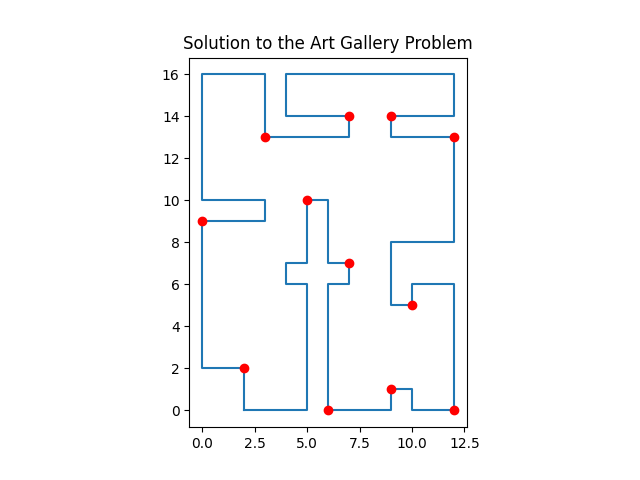

# Art gallery problem

Python implementation of the well-known "art gallery problem".  Given a simple polygon, we find a set of points in its interior ("guards") such that every point inside the polygon is visible from at least one guard.  Developed as part of the Computational Geometry course at the University of Guanajuato.

## Demo



## Algorithm

The algorithm solves the problem by following these steps:

1. **Triangulates the polygon** using the [Ear Clipping Algorithm](https://en.wikipedia.org/wiki/Polygon_triangulation#Ear_clipping_method) in $O(n^2)$. 
2. **Computes the dual graph** of the triangulation, this is, the undirected graph where every triangle is a vertex and an edge connects two vertices if the two associated triangles share one edge.
3. **Computes the 3-coloring of the vertices** induced by the triangulation, such that every triangle has all three colours in its vertices. The algorithm does so by performing a **breadth-first search over the dual graph** of the triangulation.
4. Returns the set of vertices with the least frequent color.

The amount of points returned is no greater than $\lfloor n/3 \rfloor$, as guaranteed by Chvátal's art gallery theorem.

## Installation and usage

### Clone the repository

```
git clone https://github.com/cesar80808/art-gallery-problem.git
cd art-gallery-problem
```

### Install dependencies

This project requires Python 3 and the libraries NumPy and Matplotlib. Install them using

```
pip install -r requirements.txt
```

### Input format

The input polygon must be provided in the text file "input/points1.txt". Each line should contain the $(x, y)$ coordinates of a vertex, separated by a space. For example,

```
0 0
4 0
5 2
3 2
3 4
1 3
0 4
-1 2
```

The vertices must be listed in *counterclockwise* order and the polygon must be simple (no self intersections). 

### Run

Execute the algorithm with

```
python src/main.py
```

When executed, an output file (output/solution1.txt) will be created, containing the solution points listed in the same format as in the input file. Additionally, a window displaying the input polygon and the solution points will appear.


## Future improvements

- Optimization of the triangulation algorithm to $O(n \log n)$.
- Computing and showing visibility polygons for each guard found.
- Support for polygons with holes.